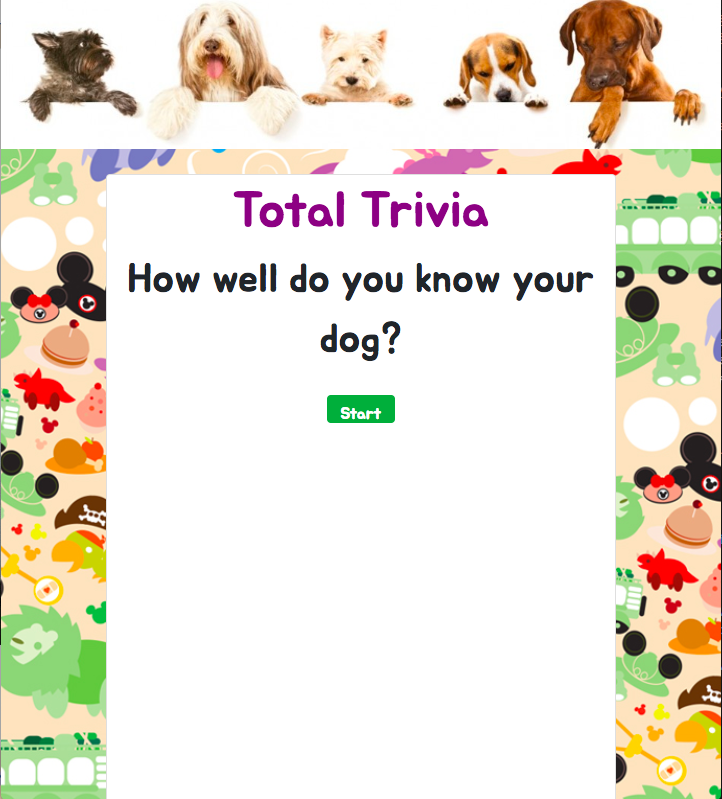
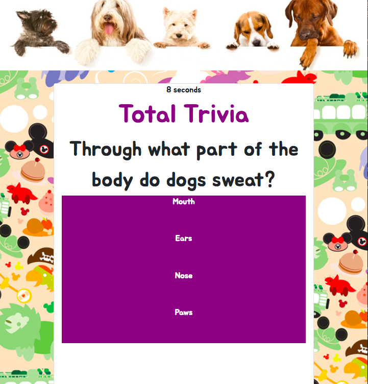
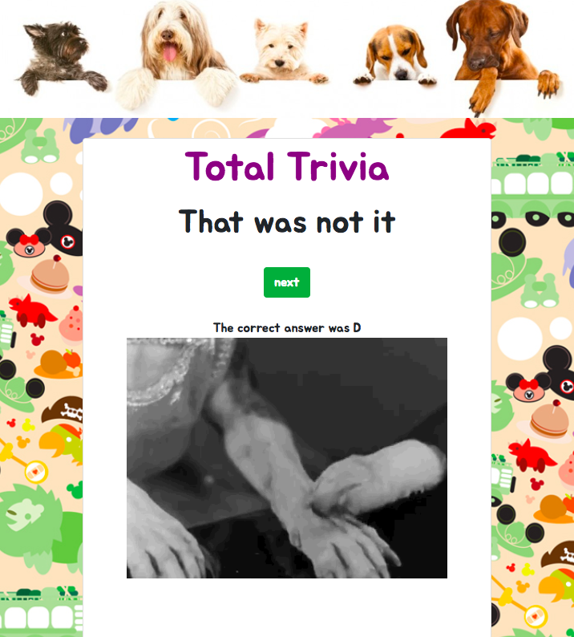

## Trivia-Game

Week 5 Assignment: Trivia Game

## A Dog Trivia
Little Trivia Game about dogs inspired by my dog Cibi/Cumulonimbus

[Start Page]
## Motivation

I chose the advanced version to challenge myself and to learn more

## Getting Started
*Play here*: https://kimkablitz.github.io/Trivia-Game/

#### Screenshots

Press start button to start

Example of a question 

GIF showing the result

## Technologies used

* Javascript
* JQuery

  

## Built with

* VSC
* Bootstrap

## Resources
* GIPHY :https://giphy.com/
* Trivia Questions retrieved from: https://www.petful.com/misc/dog-trivia-questions/
* Google Fonts
  
## Creator

* Kimmy Kablitz - *HTML/CSS/JS/JQuery*

## Acknowledgements

* Aaron Linton
* Sofi Takei & Nathan Patterson
  

